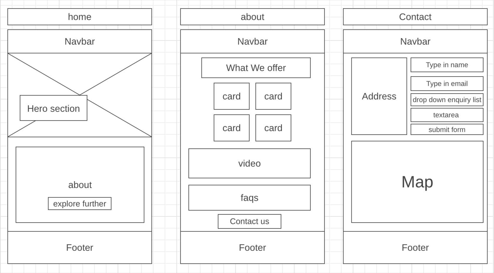
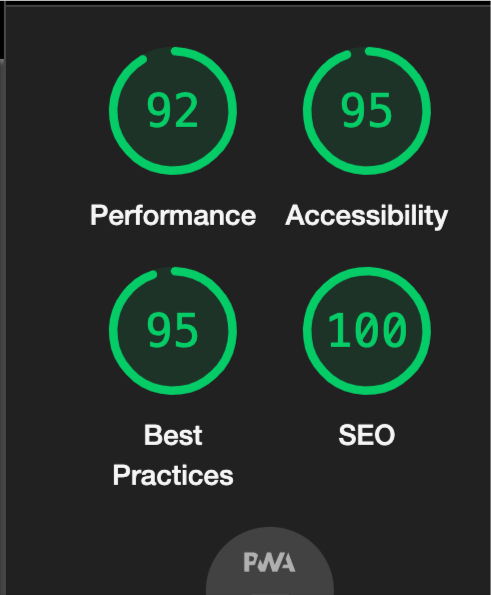
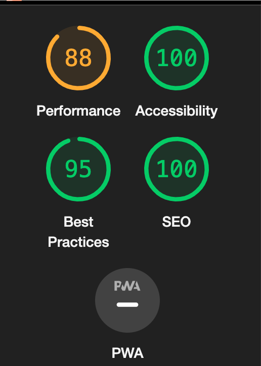
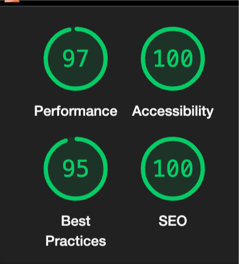

# Kaizen_fitness
 fitness website using html and css

## Introduction
Welcome to Kaizen Fitness! This website serves as an educational platform where I've used the power of HTML and CSS to create a simple yet impactful fitness platform.

At Kaizen Fitness, I've made this site exclusively for learning purposes. It's a hands-on demonstration of HTML and CSS fundamentals, showcasing how these technologies work together to build a functional website.

Join me on this educational journey through Kaizen Fitness, where simplicity meets the art of web development using HTML and CSS.

***

## Target audience
Kaizen Fitness is crafted for gym-goers and fitness enthusiasts seeking an interactive online space. It's tailored to individuals passionate about fitness and improving themselves, aiming to enhance their workout experiences and explore a digital platform dedicated to health and wellness.

---

The word 'Kaizen originating from Japanese philosophy, embodies the concept of continuous improvement. At Kaizen Fitness, this principle drives our approach, fostering progress and growth in the fitness journey of each visitor."

---

## Wireframe design

This wireframe represents the foundational design of the Kaizen Fitness website. It's an initial visual blueprint I've created to plan and structure the website's layout and elements.

---

## Navbar

This image shows the responsive navbar designed for mobile screens. It features a toggle burger icon that expands to reveal navigation options, ensuring easy access and smooth navigation on smaller devices.

Here's the navbar at tablet size and larger screens. This design doesnt have a burger icon you can see the navitems inrow to choose from it has a clean layout, offering a user-friendly navigation experience across tablets and wider screen sizes.

---

## Website Structure Overview

### Home Page
The home page features a responsive navbar at the top, followed by a captivating hero section. Beneath it, discover the fitness gym's mission in card format, offering further exploration through a linked 'About' page. Completing the page is a footer with social media links and contact details represented with icons.

### About Page
Navigate through 'What We Offer' in four informative card formats detailing various gym amenities. Dive deeper into the gym's ambiance through an embedded video, followed by FAQs. At the bottom, find a 'Contact Us' button that directs to the contact page. and a footer at the bottom with with social media links and contact details represented with icons.

### Contact Page
On this page, submit inquiries via a user-friendly form on the right, while the left showcases the gym's address. Further down, explore the location through an integrated map and find contact details and our social in the footer, maintaining consistency across pages represented with icons.

---

## Performance Testing: Lighthouse Results

I conducted performance testing using Lighthouse to evaluate various aspects of the website, including SEO, accessibility, and overall performance. Below are the results for each page:

### Home Page

### About Page

### Contact Page

---

## Credits

- The initial layout of the website was inspired by the [Love Running Project](https://learn.codeinstitute.net/courses/course-v1:CodeInstitute+LRFX101+2023_Q2/courseware/e805068059af42af87681032aa64053f/7525117e5cd144daa2a7b0c57843bbee/), providing a foundational structure for the pages.

- I utilized the navigation bar design from the [Love Running Project](https://learn.codeinstitute.net/courses/course-v1:CodeInstitute+LRFX101+2023_Q2/courseware/e805068059af42af87681032aa64053f/7525117e5cd144daa2a7b0c57843bbee/) to ensure a user-friendly and consistent navigation experience.

- The responsive equal-height images with CSS, featured in the card formats on the 'About' page, were adapted from a helpful demonstration on [CodePen](https://codepen.io/sarus/pen/PJGPmy).

- The making of the hero image was done by utilizing the same method used in the [Love Running Project](https://learn.codeinstitute.net/courses/course-v1:CodeInstitute+LRFX101+2023_Q2/courseware/e805068059af42af87681032aa64053f/92a91cf7fcee4361a2af651b7827a341/?child=first)

- I learned to implement a dark mode for maps within iframes from a tutorial on [YouTube](https://www.youtube.com/watch?v=lIlHLFM03qs), enhancing the visual appeal of location details.

- I got a bit of an idea of making this website when it comes to the button that links to different pages and the card formats that change to column or row format depending on the screensize of the device from [SubaxTech website](https://yasirwiifto.github.io/SubaxTech/)

---

## Conclusion
Building Kaizen Fitness has been an awesome learning experience for me in website creation using HTML and CSS. It's been a real eye-opener into how websites are made and how these codes work together. This project helped me dive deeper into the basics of web development.

I'm really excited to keep improving and learning more about making websites and about web developing. This project is just the beginning, and I can't wait to see where it takes me in my coding journey. Thanks for being part of this journey with me on Kaizen Fitness!